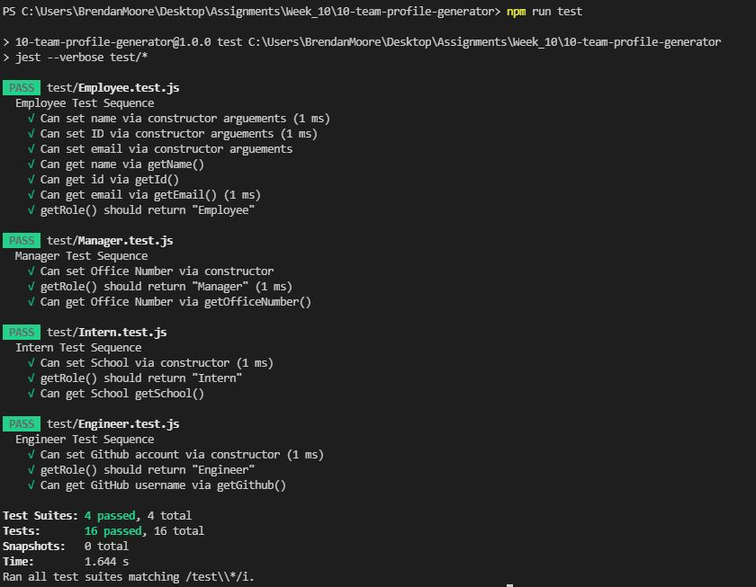
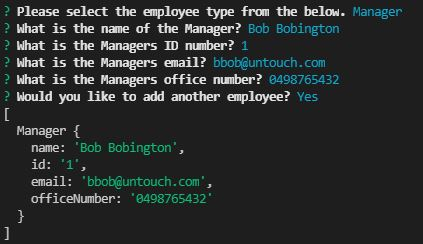
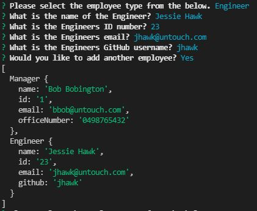
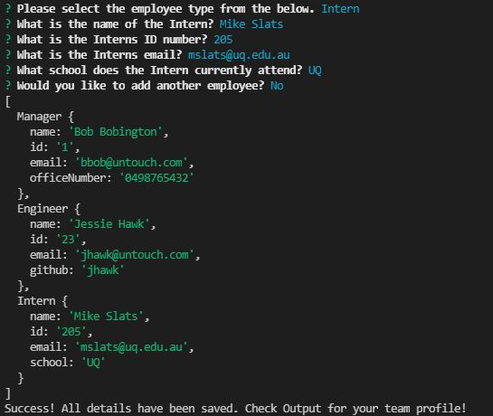
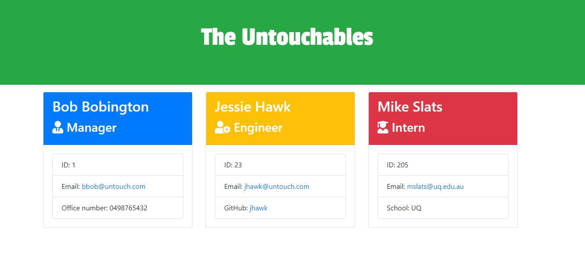

# Team Profile Generator

  

  ## Table of Contents
  - [Description](#description)
  - [Installation](#installation)
  - [Usage Information](#usage-information)
  - [License](#license)
  - [Contribution Guidelines](#contribution-guidelines)
  - [Test Procedure](#test-procedure)
  - [Questions](#questions)
  - [Images](#images)

  ## Description
  Building a Node.js command-line application that takes in information about employees on a software engineering team. It will then generate an HTML webpage that displays summaries for each person. You will also need to write unit tests for every part of code and ensure they pass each test.

  - [Video showing how the Team Profile Generator operates, including the unit testing](https://drive.google.com/file/d/1H-NNYjvAUkKtRYbZ9-SYsehArF8Zw_A2/view?usp=sharing)
  - [Link to Repo](https://bdjm94.github.io/10-team-profile-generator/)

  ## Installation
  npm install jest & npm install inquirer

  ## Usage Information
  Use this repo to build team profiles for your work. Limited to having a Manager, Engineer and Intern as part of your team profile.

  ## License
  No License

  ## Contribution Guidelines
  You can contribute freely

  ## Test Procedure
  npm run test (ensure that jest --verbose test/* is a script in your package.json)

  ## Questions
  If you have any questions, then feel free to contact me on the below:
  - Github: [bdjm94](https://github.com/bdjm94)
  - Email: [brendandjmoore@gmail.com](brendandjmoore@gmail.com)

  ## Images
| All unit tests passed |
|------------|
  

| Manager Prompt |
|------------|
  

| Engineer Prompt |
|------------|
  

| Intern Prompt |
|------------|
  

| Completed Team Profile |
|------------|
  

